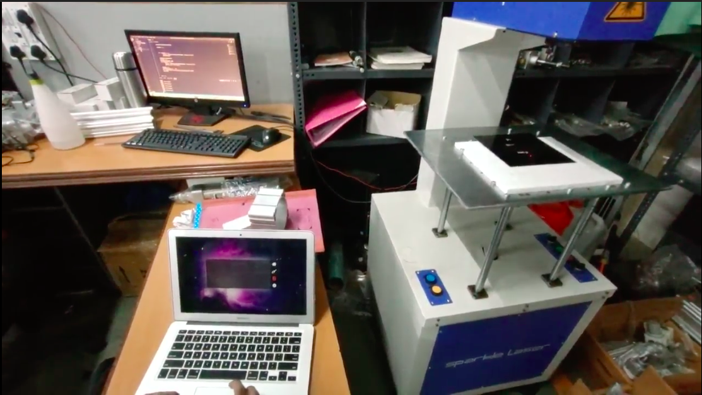

# Laser Engraver

## Working 

User opens the app 

User Draws on the canvas (canvas api of browsers) 

User Clicks print 

Users drawing get converted into Image/data url(base 64) 

Then the PNG gets uploaded to server 

Server processes the image 

Python client runnning on the computer downloads the image 

Python program written for Robotic Process Automation opens the image and Feeds to engraver's original software 

Engraving starts 

Engraving is done 

User is notified

## Demo Here

# Frontend tech stack 
 
HTML 

CSS 

JS 

ReactJS 

Styled Components

#Robotic Process Automation

Python 

Pywinauto

PyautoGUI

# Backend tech stack 

NodeJS 

Express

PNG / SVG processing

## Hosting 

Linode VPS

## License
[MIT](https://choosealicense.com/licenses/mit/)
